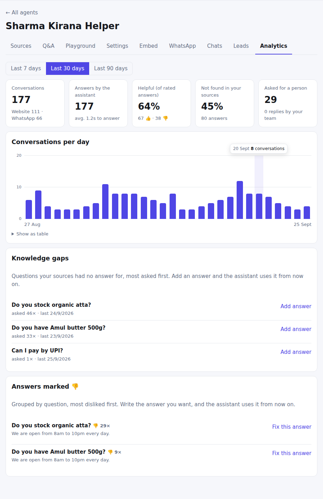

# Analytics

**Where:** Agent → **Analytics**

Shows how the assistant is doing and what to teach it next. Pick the last 7, 30 or 90 days. Days are counted in Indian
time, and your own playground tests are left out.

## What it shows

- **Conversations**, split by channel.
- **Answers by the assistant** and the average time to answer.
- **Helpful**: the share of rated answers marked 👍.
- **Not found in your sources**: how often the assistant had nothing to go on.
- **Asked for a person**, and how many replies your team sent.
- A chart of **conversations per day**. Hover over a day for the exact count, or open it as a table.

## Act on it

1. **Knowledge gaps** lists questions nothing in your sources answered, most asked first.
2. Press **Add answer** next to one and write the answer; it's used from then on, and the question stops counting as a gap.
3. **Answers marked 👎** lists what customers didn't like, grouped by question, with **Fix this answer**.

