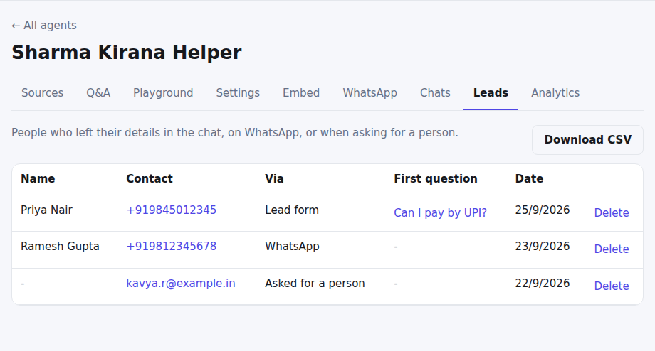
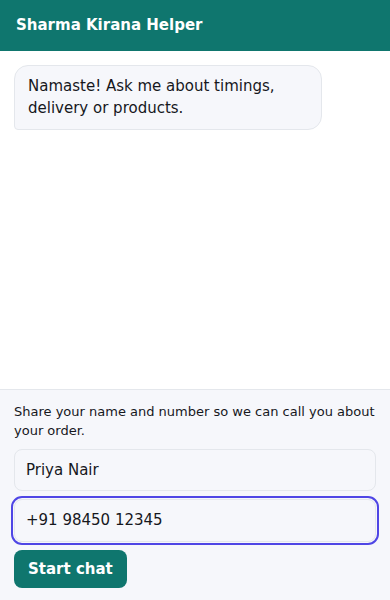

# Leads

**Where:** turn it on in **Settings → Collect leads**; see the results in the **Leads** tab.

## Collect visitors' details

1. Choose when to ask: **After the first answer** (visitors can skip, and the skip is remembered) or
   **Before the chat starts** (required).
2. Tick the details to ask for (name, e-mail, phone) and write the message shown above the form.
3. Open **Leads** to see everyone who left details. Click their first question to open the chat.
4. Press **Download CSV** to open the list in Excel or Google Sheets.

## Where leads come from

- **The lead form** in the website chat. Phone numbers and e-mails are checked before saving. You get an e-mail for each
  new lead if e-mail alerts are on.
- **WhatsApp**: every customer, with their number and profile name.
- **Asked for a person**: the phone or e-mail a visitor leaves during a handoff.

You can delete a lead (for example if a customer asks to be forgotten); the conversation stays. The CSV opens correctly in
Excel with Hindi names, and is protected against spreadsheet formula tricks.

