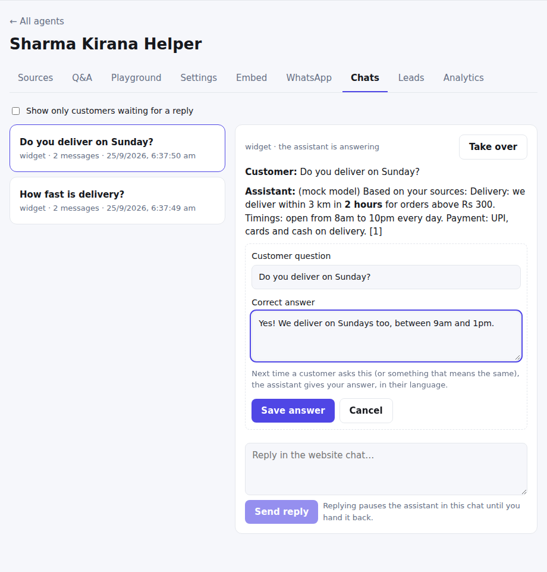
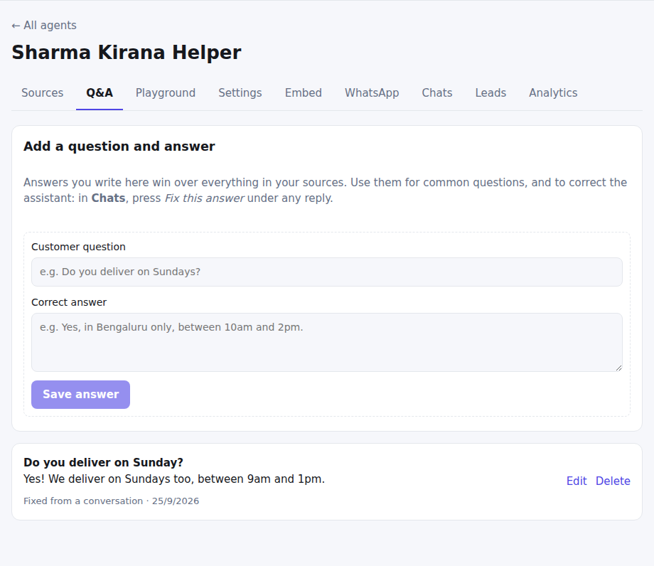
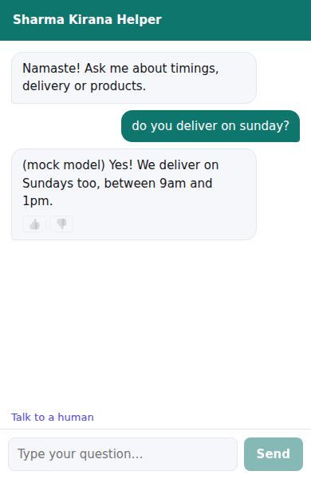

# Q&A answers and "Fix this answer"

**Where:** Agent → **Q&A**, and a **Fix this answer** link under every bot answer in **Chats** and **Analytics**.

Answers you write take priority over everything in your sources. When a customer asks the same question, or one that
means the same, the assistant gives your answer, in the customer's language. This is the fastest way to correct the
assistant.

## Fix an answer from a real conversation

1. In **Chats**, open a conversation and press **Fix this answer** under the reply you want to change.
2. The form is filled in with the customer's question and the bot's answer. Rewrite the answer and press **Save answer**.
3. The reply is marked **✓ Fixed**, and the next customer who asks gets your answer.

## Write answers ahead of time

Use the **Q&A** tab to add answers before anyone asks, and to edit or delete them.

## Good to know

- Up to 500 Q&A answers per agent. Changes take effect at once.
- Questions are matched by meaning, not exact words.
- An answer from Q&A has no source link, so no unrelated citations are shown with it.
- The playground uses your Q&A answers too, so you can check a fix right away.

