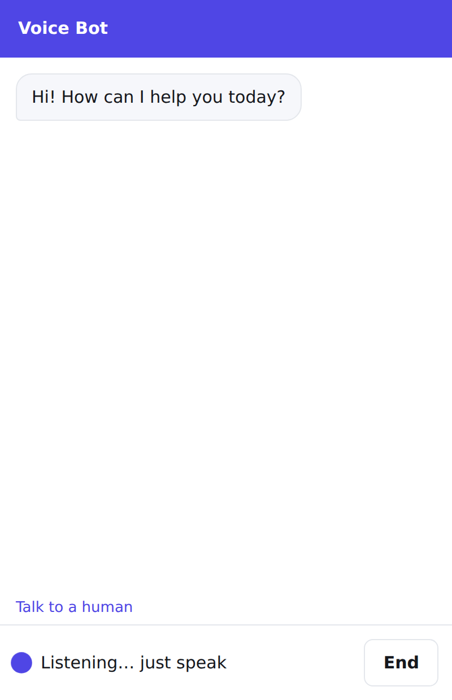

# Talk to the assistant (voice)

**Where:** Agent → **Voice**

Customers can **talk** to the assistant instead of typing: with the microphone button in the website chat, or by calling
a phone number. It understands English, Hindi, Hinglish and 9 other Indian languages, answers from the same sources and
Q&A answers, and replies out loud in the caller's language, in one to three short sentences.

## Turn it on

1. Open Agent → **Voice**.
2. Tick **Show a microphone button in the website chat**.
3. Pick a voice (for example Anushka or Karun) and the language to use when the caller's language can't be detected.
4. Optionally write the first thing it says (otherwise it uses your welcome message).
5. Press **Save**. Visitors press the microphone, allow it, and just speak. What they said and the answers also appear in
   the chat.

## Phone calls

1. Add the **number to transfer to** when a caller asks for a person (with country code, like `+919876543210`).
2. Connect a phone number from **Plivo** or **Exotel**:
   - **Plivo**: copy the **Plivo Answer URL** from the Voice tab into your Plivo application (method POST) and link your
     number to that application.
   - **Exotel**: in your call flow, add a **Voicebot** applet with the **Exotel stream URL**, and a **Connect** applet to
     your number after it.
3. Call the number to test it.

The addresses contain a secret: don't share them. If one leaks, press **Make new addresses** and update them in
Plivo or Exotel.

## How conversations go

- **Fast**: the first sentence is spoken while the rest of the answer is still being written.
- **Interruptible**: when a caller talks over the assistant, it stops at once and answers the new question.
- **Handing over**: "let me talk to a person" (in any of the supported phrasings, including "insaan se baat karni hai")
  hands the conversation to you. On calls with a transfer number, the call is transferred; otherwise you get the usual
  alert, and **Chats** shows the caller's number so you can call back.
- Each spoken answer uses one message credit. Voice conversations show in **Chats** and **Analytics**.

For the platform side (the voice gateway, Sarvam, settings), see [voice agents](../voice.md).
