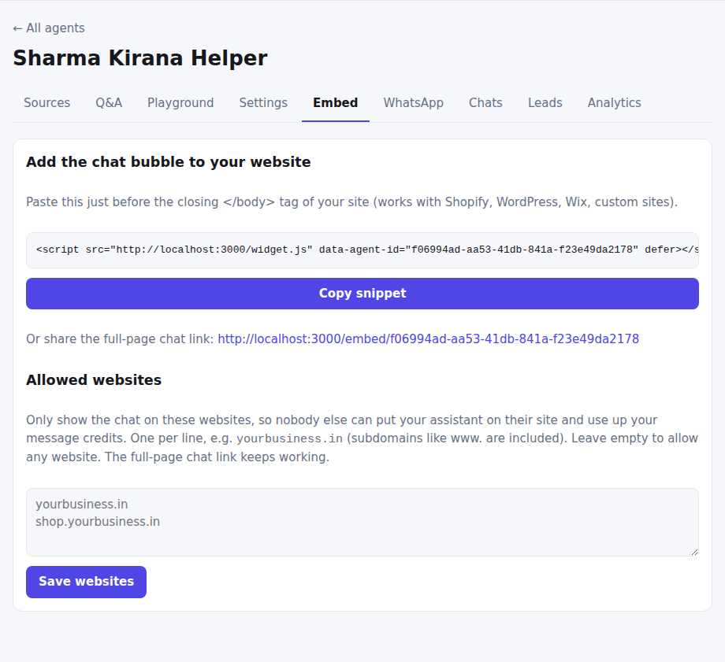
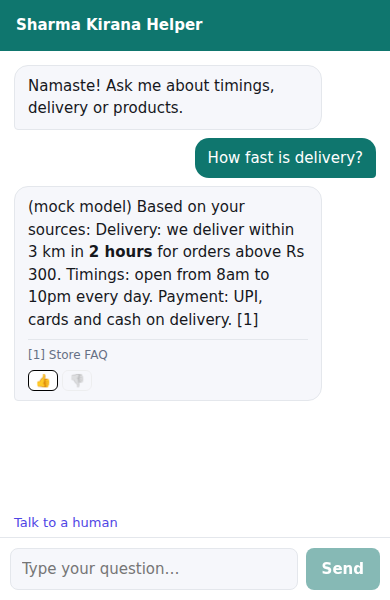

# Website chat

**Where:** Agent → **Embed**

## Add the chat to your website

1. Press **Copy snippet**. It looks like
   ``.
2. Paste it just before `</body>` on your site. It works with Shopify, WordPress, Wix and hand-built sites.
3. A chat bubble appears in the corner. Optional attributes: `data-position="left"` and `data-color="#0f766e"`.
4. You can also share the **full-page chat link** (`/embed/<agent id>`) on social media, in QR codes or in e-mails.

## What visitors get

- Answers appear word by word as they're written, with bold, lists and links, and numbered source links.
- The conversation is kept when they reload the page.
- **Talk to a human** under the chat, 👍 / 👎 under each answer, and optionally a [details form](leads.md).
- A microphone button, when [voice](voice.md) is turned on.

## Allowed websites

An agent's ID is public, so anyone could copy your snippet onto their own site and spend your message credits. Listing
your websites stops that.

1. Under **Allowed websites**, enter your sites, one per line, for example `sharmakirana.in`. Subdomains such as `www.`
   or `shop.` are included.
2. Press **Save websites**. Leave the box empty to allow any website (the default).

- On other sites the bubble doesn't appear. If someone forces the chat into a frame there, it says
  "This chat isn't enabled for this website".
- The full-page chat link keeps working everywhere.
- Up to 20 websites. This stops other websites from showing your chat; it doesn't stop someone who writes their own
  program to call the chat directly, but per-visitor rate limits still apply to them.
